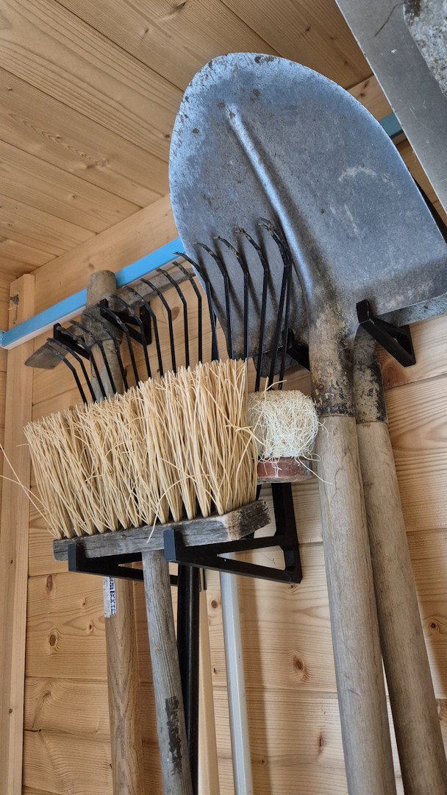
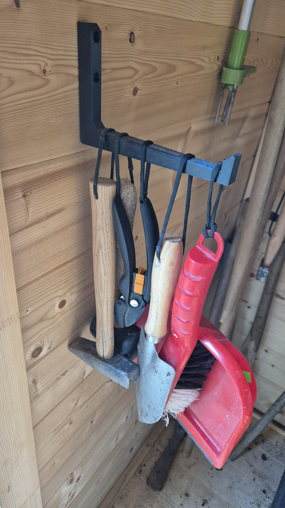
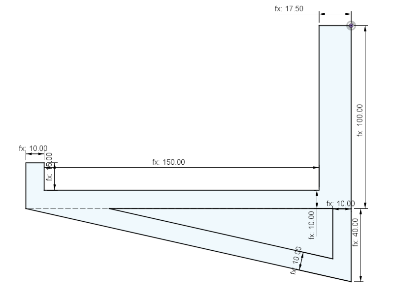
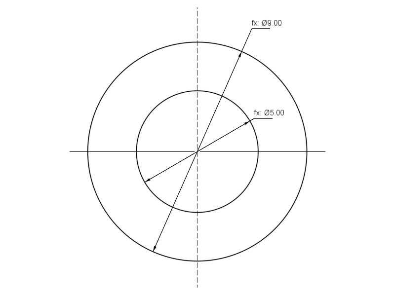
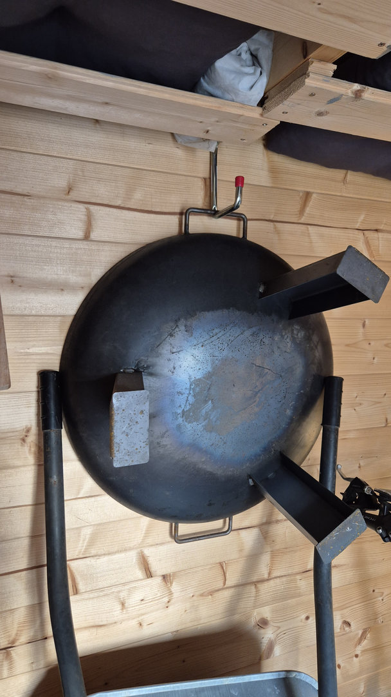

# Garden House Hook

A practical hook designed for use in a garden house or shed. Ideal for hanging lightweight tools, accessories, or garden equipment, helping keep your workspace organized and within easy reach.

Low profile version:

## Rough Dimensions

Thickness: 1 cm
Length: 15 cm

Screw diameter: max 5 mm

## Print Settings

| Setting | Value |
|---|---|
| Layer Height | 0.2 mm |
| Nozzle Diameter | 0.4 mm |
| Material | PETG / ASA |

## Slicer Settings

| Setting | Value |
|---|---|
| Infill | 15% |
| Infill Pattern | Gyroid |
| Perimeters | 4 |
| Supports | No |

## Notes

Use PETG for good durability and moisture resistance, making it suitable for garden houses or sheds. For outdoor use, ASA is recommended due to its superior UV and weather resistance.

Keep in mind that 3D printed parts have limited strength. For heavier items, consider using metal hooks.

## Files Included

- [GardenHouseHook.stl](stl/GardenHouseHook.stl)
- [GardenHouseHook_LowProfile.stl](stl/GardenHouseHook_LowProfile.stl)

## License

CC BY-NC-SA  
Free for personal use and remixing. No commercial use or selling prints without explicit permission.