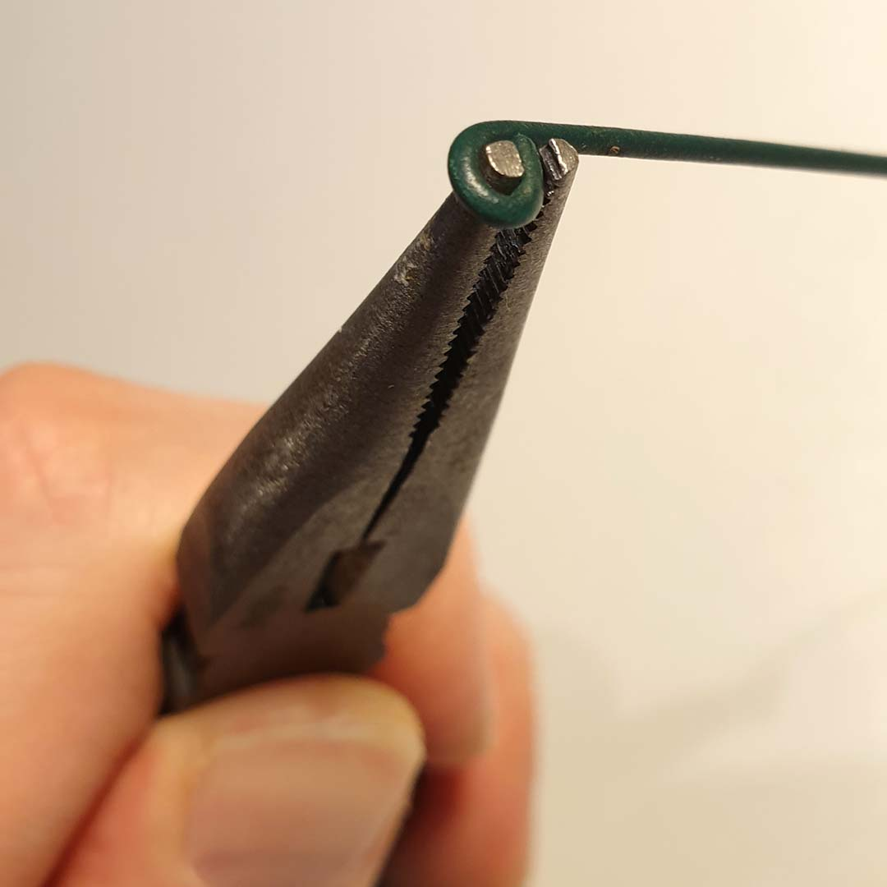
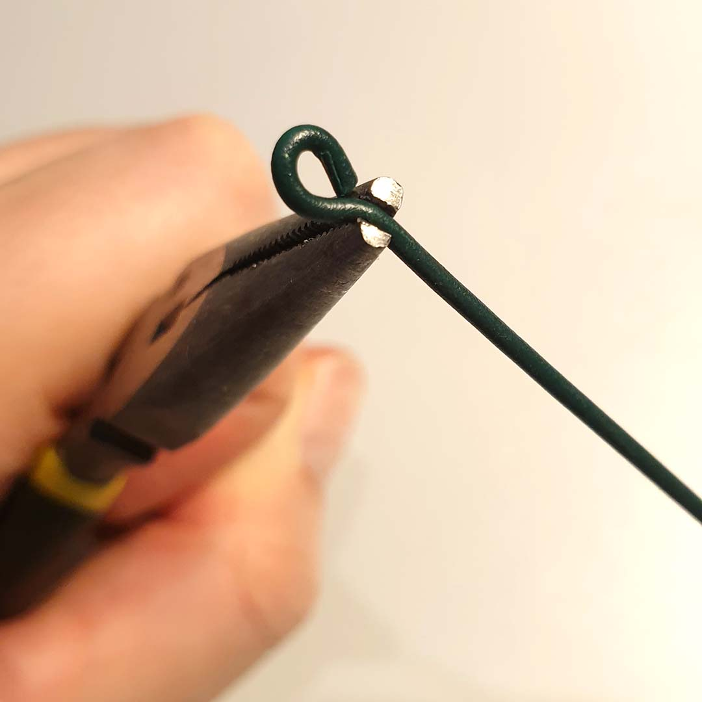
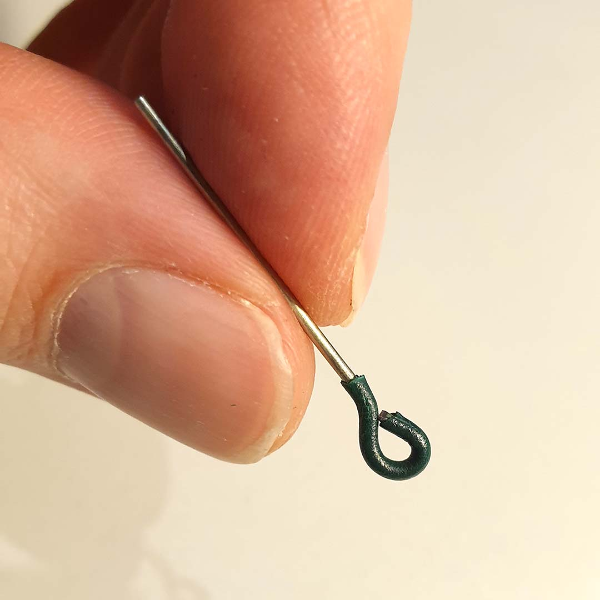

# Grenade Container

## Project Overview

Tabletop model of a grenade for 3D printing, which also serves as a stash.

It's not entirely accurate (the design model was [MK2](https://en.wikipedia.org/wiki/Mk_2_grenade)), but it still looks pretty convincing. If you use a spring or rubber band, the safety flies off when you release it. The thread has a small offset, so the lock is pretty tight.

It may be slightly larger than a real one, but you can scale it in slicer software if needed.

---

I also tried to scale it to 50% of the designed size to print it as a keychain. Unfortunately, it's pretty hard to close. The small size needs a few adjustments, especially in the main thread design. Might come in the future.

---

## Print Settings

- Layer Height: 0.2 mm  
- Nozzle Diameter: 0.4 mm  
- Material: PLA / PETG  

---

## Slicer Settings

- Infill: 15%  
- Infill Pattern: Gyroid  
- Perimeters: 2  
- Supports: No (except Safety)

---

## Components & Printing

| # | Component | Orientation | Color | Supports |
|--:|----------|------------|-------|----------|
| 1 | BodyBottom |  | Olive (Spectrum PLA - Wizzard Green) | No |
| 2 | BodyTop |  | Olive + Yellow (Spectrum PLA - Wizzard Green, Gembird PLA - Yellow) | No |
| 3 | Coupler |  | Red (Devil Design PETG - Ruby Red Transparent) | No |
| 4 | Top |  | Gray (Devil Design PET - Gray) | No |
| 5 | EjectorLever |  | Gray (Devil Design PET - Gray) | No |
| 6 | Safety |  | Gray (Devil Design PET - Gray) | Yes |

Only the **Safety** component requires supports. It is recommended to place supports only on edges for easier removal.

To achieve a nice result, consider printing the first few layers (approx. first 4 mm) of the **BodyTop** component in yellow.

---

## Assembly Instructions

### Required Tools & Parts

- Keychain ring  
- Pliers  
- Wire (∅ 1.0–1.5 mm, binding wire works fine)  
- Spring (~5 × 20 mm) or small rubber band  

---

## Assembly

To install the **EjectorLever**, use a wire. Create a hook and pull the spring or rubber band to the bottom of the **Top** component.

Then click the **EjectorLever** onto the axis in the middle of the **BodyTop** using pliers or a narrow tool.

---

The pin is made from wire. Use pliers to create a loop at the end.

  
  

---

## Post-Processing

There is a small offset on the thread to ensure a tight fit. Initially, it may be difficult to close properly.

- Open and close repeatedly  
- Lightly sand contact surfaces if needed  

Sometimes it helps to leave it tightly closed for a few hours and then repeat the process.

---

## Notes

- Tested on Prusa MK3S  
- Should work on other printers  
- Scaling (e.g. 50%) may require thread redesign  

---

## Responsibility

At first glance, it may look real. Behave responsibly.

---

## License

MIT