# Grenade Container

Tabletop model of a grenade for 3d printing, which also serves as a stash.

It's not entirely accurate (the design model was [MK2](https://en.wikipedia.org/wiki/Mk_2_grenade)), but it still looks pretty convincing. If you use a spring or rubber band, the safety flies off when you release it. The thread has a small offset, so the lock is pretty tight.

I think, that it's a little bigger than a real one, but you can scale it in a slicer software, if you want to.

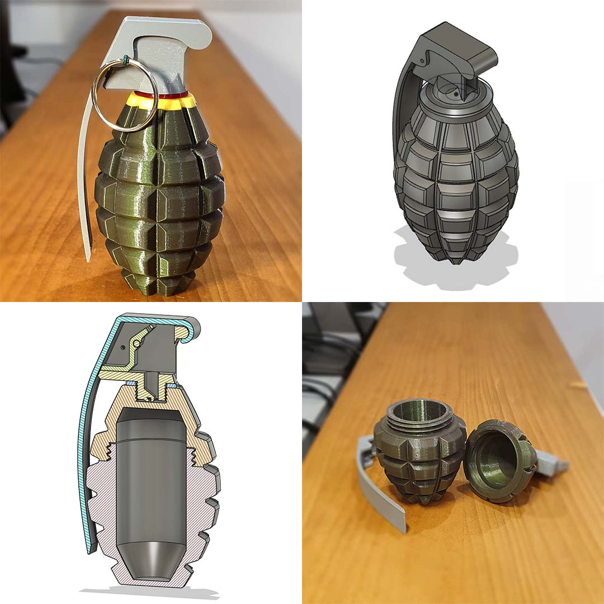

---

I also tried to scale it to 50% of the designed size to print it as a keychain. Unfortunatelly, it's pretty hard to close. The small size needs few adjustments, especially in the main thread design. Might come in the future.

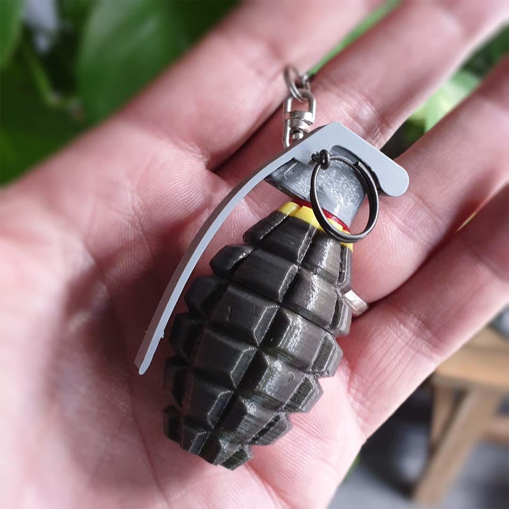

## Print Settings

- Layer Height: 0.2 mm  
- Nozzle Diameter: 0.4 mm  
- Material: PLA / PETG  

## Slicer Settings

- Infill: 15%  
- Infill Pattern: Gyroid  
- Perimeters: 2  
- Supports: No (except Safety)

## Assembly instructions

Except the printed parts you will need keychain ring, pliers, wire ∅ 1.0 - 1.5mm (binding wire works fine) and a spring (cca 5 x 20 mm) or smaller rubber band.

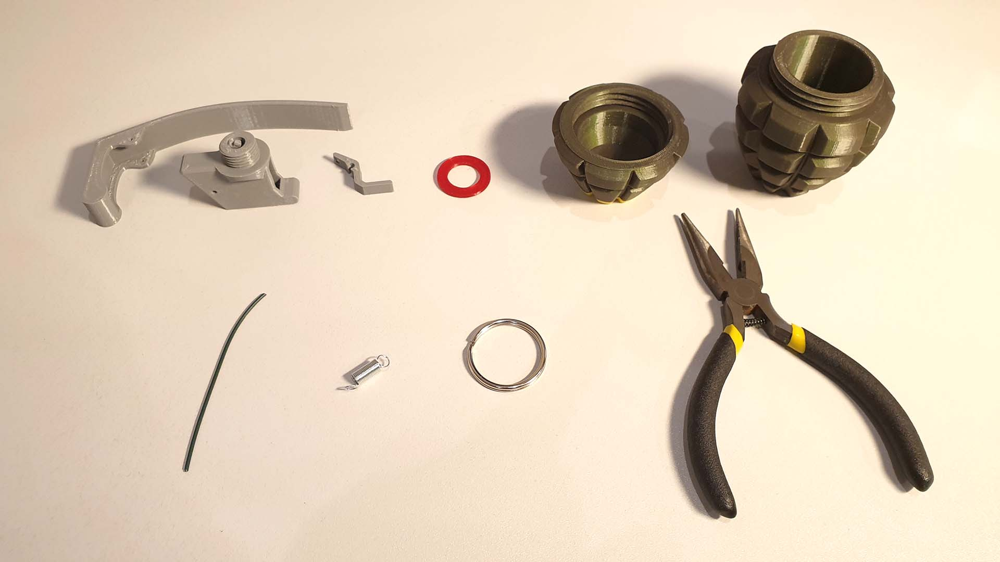

## Printing

The following is a list of components and their orientation when printing. As material I used PLA and PETG. Resolution 0.2 mm, infill 15%.

*Components*

| # | Component name | Preview and print orientation | Color [used filament] | Supports |
|---|---|---|---|---|
| 1 | BodyBottom | 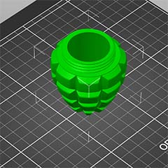 | Olive [Spectrum PLA - Wizzard Green] | no |
| 2 | BodyTop | 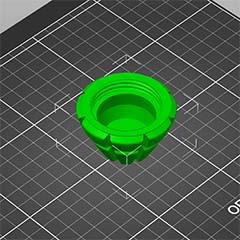 | Olive + Yellow [Spectrum PLA - Wizzard Green, Gembird PLA - Yellow] | no |
| 3 | Coupler | 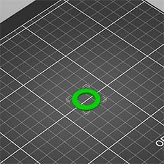 | Red [Devil Design PETG - Ruby Red Transparent] | no |
| 4 | Top | 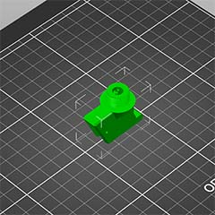 | Gray [Devil Design PET - Gray] | no |
| 5 | EjectorLever | 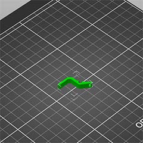 | Gray [Devil Design PET - Gray] | no |
| 6 | Safety | 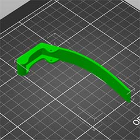 | Gray [Devil Design PET - Gray] | yes |

---

As you may have noticed, the only component that needs suppports is *Safety*. I recommend making supports only on the edges to make it easier to remove them later.

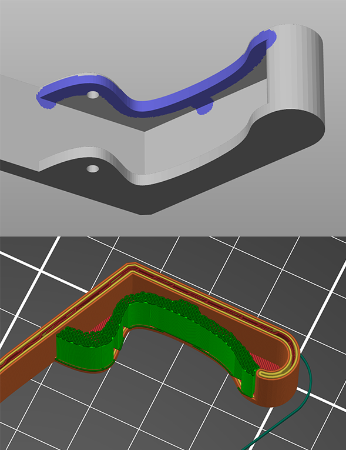

---

To achieve a nice result, consider printing the first few layers (approx. first 4 mm) of the *BodyTop* component in yellow.

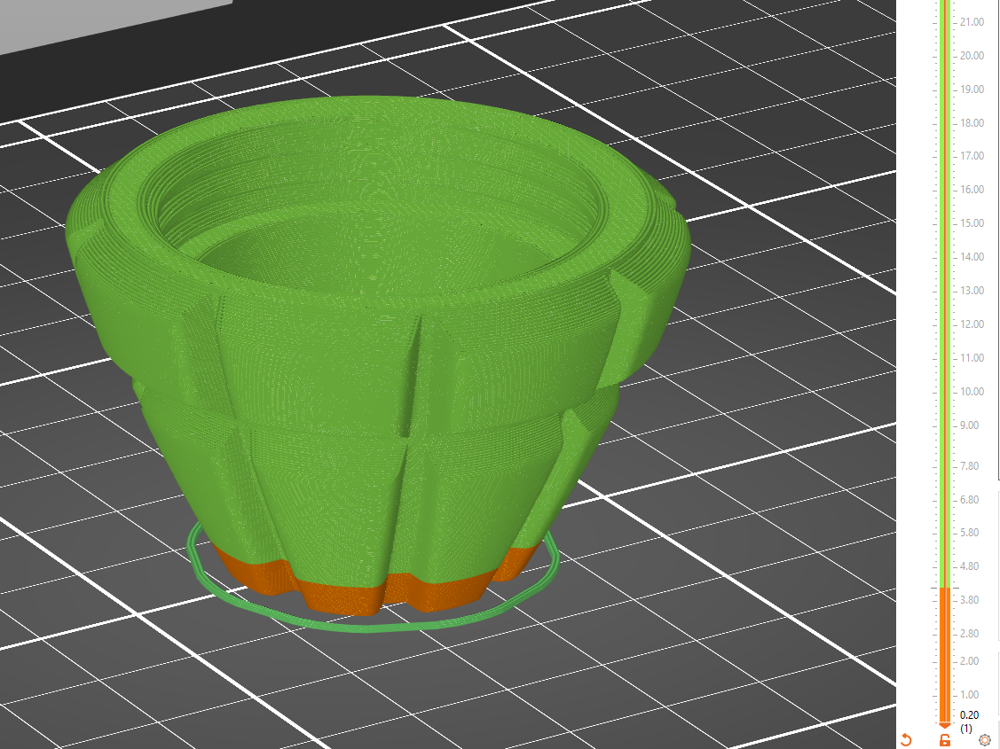

## Assembly

To install *EjectorLever* component, you can use a wire. Create a hook and pull the spring or rubber band on the bottom of *Top* component as you can see on the image.

Then click the *EjectorLever* on the axis in the middle of the *BodyTop* component using pliers or some narrow tool.

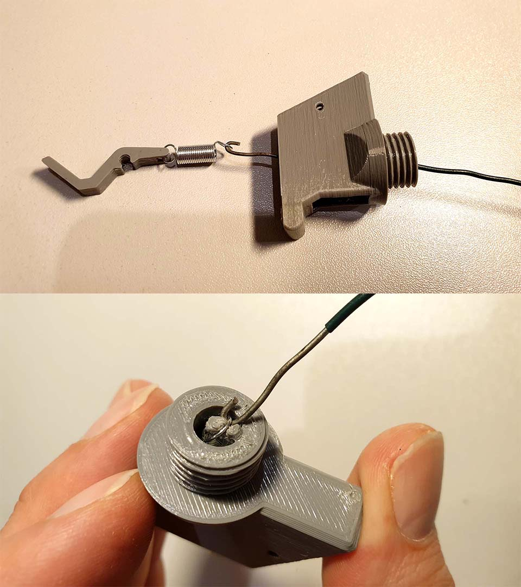

---

The pin is made from the wire. I used a binding wire, which is often used for gardening. Use pliers to make a loop at the end of the wire.

The rest of the assembly should be pretty straightforward process.

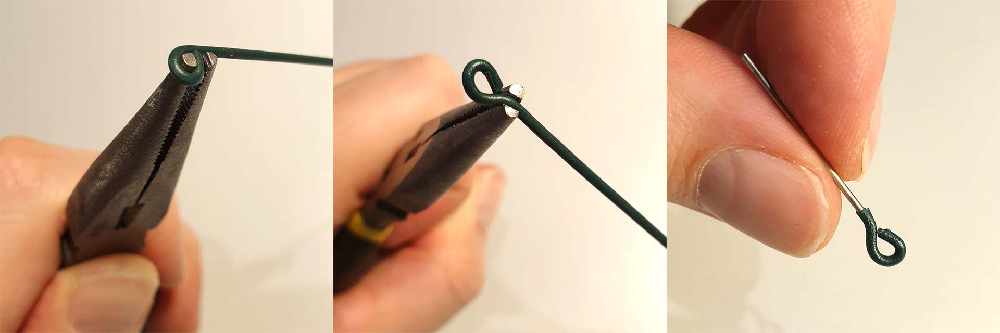

---

There is a small offset on the thread to close it tightly. At first it may be difficult to close it with the clusters properly aligned.

Try to opening and closing it multiple times. If necessary, do some postprocessing using sand paper on the contact surfaces.

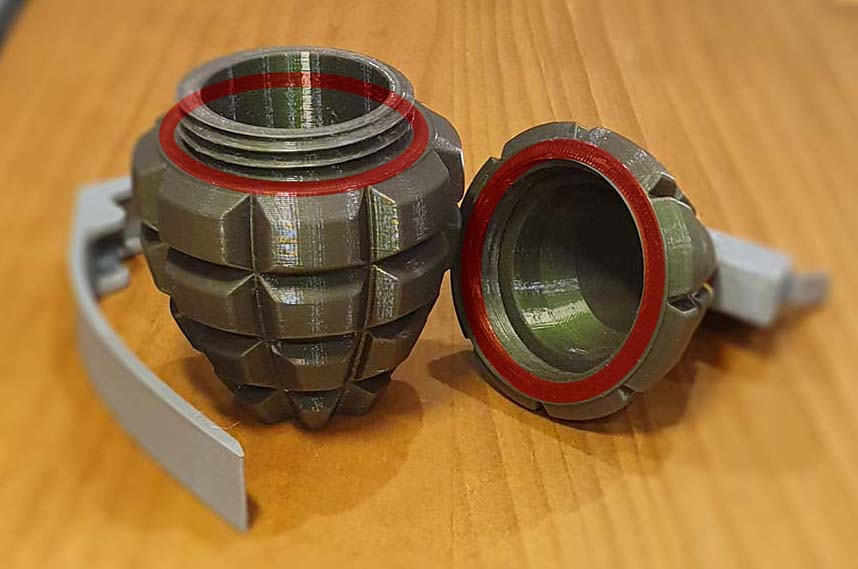

Sometimes it helps to leave it firmly tightened for a few hours and then repeat the opening/closing process.

Mine was printed on Prusa MK3S. I hope this will work on other 3d printers as well.

## Responsibility

At first glance, it may look real. Behave responsibly.

## License

CC BY-NC-SA

Free for personal use and remixing. No commercial use or selling prints without explicit permission.