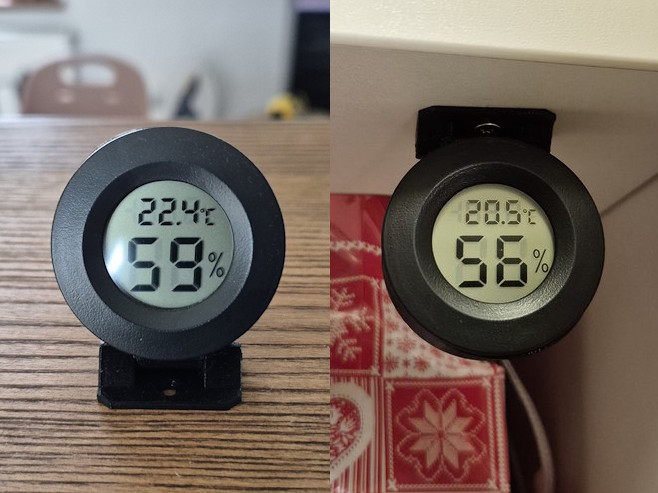

# Hygrometer stand

A hygrometer cover with dual mounting options (standing or hanging). Single-axis design allows easy up-and-down positioning.

## Print Settings

| Setting | Value |
|---|---|
| Layer Height | 0.2 mm |
| Nozzle Diameter | 0.4 mm |

## Slicer Settings

| Setting | Value |
|---|---|
| Infill | 15% |
| Infill Pattern | Gyroid |
| Perimeters | 2 |
| Supports | No |

## Assembly Instructions

For the axis, use a piece of 1.75 mm filament.

## License

CC BY-NC-SA

Free for personal use and remixing. No commercial use or selling prints without explicit permission.