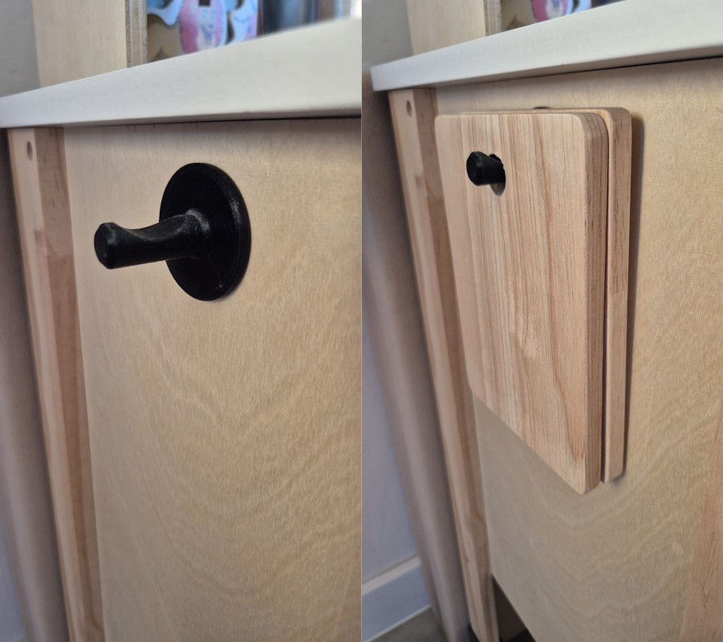

# Kitchen Hook

Very simple hook, intended for sticking with double-sided adhesive tape. Suitable for hanging light tools.

## Print Settings

| Setting | Value |
|---|---|
| Layer Height | 0.2 mm |
| Nozzle Diameter | 0.4 mm |
| Material | PETG |

## Slicer Settings

| Setting | Value |
|---|---|
| Infill | 15% |
| Infill Pattern | Gyroid |
| Perimeters | 2 |
| Supports | No |

## Files Included

- [KitchenHook.stl](stl/KitchenHook.stl)

## License

CC BY-NC-SA  
Free for personal use and remixing. No commercial use or selling prints without explicit permission.